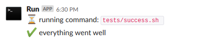

# Run 

Run is the simplest way to run a command and post its execution status to slack :



## Usage

Just prefix any commands with run:

```SHELL
run python script.py
```

## Setup

Download the [latest release](https://github.com/selency/run/releases) to `/usr/local/bin/run`.

Add a `run-config.json` file to your `$HOME/.run/run-config.json`:

```JSON
{
  "slack": {
    "token": "1234",
    "channel": "monitoring",
    "username": "server-01",
    "emoji": ":gear:"
  }
}

```
